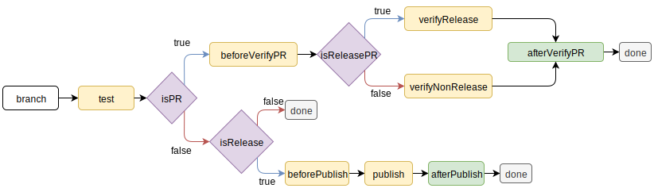

# ci-builder

[](https://www.npmjs.com/package/@ioffice/ci-builder)
[](LICENSE)
[](https://travis-ci.com/iOffice/ci-builder-eslib)

CIBuilder is a tool to help us specify the build process within the node environment. It does this
by providing a single point of entry which branches off depending on the defined methods and
environment variables found in the ci tool.

## Installation

```
yarn add @ioffice/ci-builder -D
```

## Usage

Create a file where all the commands for the build flow will be defined. The following is a
barebones file example which prints the step names.

```typescript
import { CIBuilder, runBuilder, StepResult, IReleaseInfo } from '@ioffice/ci-builder';

class Builder extends CIBuilder {
  readonly releaseBranchMerged = /^Merge pull request #(\d+) from (.*)\/release(.*)/;

  isRelease(branch: string, commitMsg: string): boolean {
    const isMasterBranch = ['master', 'refs/heads/master'].includes(branch);
    return isMasterBranch && !!commitMsg.match(this.releaseBranchMerged);
  }

  isReleasePullRequest(pullRequestBranch: string): boolean {
    return pullRequestBranch === 'release';
  }

  test(): Promise<StepResult> {
    return this.io.success(0, 'test');
  }

  afterPublish(): Promise<StepResult> {
    return this.io.success(0, 'afterPublish');
  }

  afterVerifyPullRequest(): Promise<StepResult> {
    return this.io.success(0, 'afterVerifyPullRequest');
  }

  beforePublish(): Promise<StepResult> {
    return this.io.success(0, 'beforePublish');
  }

  beforeVerifyPullRequest(): Promise<StepResult> {
    return this.io.success(0, 'beforeVerifyPullRequest');
  }

  publish(): Promise<StepResult> {
    return this.io.success(0, 'publish');
  }

  releaseSetup(param: IReleaseInfo): Promise<StepResult> {
    const { currentVersion: current, newVersion } = param;
    return this.io.success(0, `releaseSetup: ${current} -> ${newVersion}`);
  }

  verifyNonRelease(): Promise<StepResult> {
    return this.io.success(0, 'verifyNonRelease');
  }

  verifyRelease(): Promise<StepResult> {
    return this.io.success(0, 'verifyRelease');
  }
}

async function main(): Promise<void> {
  const { code } = await runBuilder(Builder);

  process.on('exit', () => {
    process.exit(code);
  });
}

// Do not execute if the file is imported
if (require.main === module) {
  main();
}
```

Each method definition will be called depending on the environment variables defined. The following
diagram shows the three types of flows that are encountered when running within a CI environment.



### branch

Each build runs on a branch if the ci tool allows it. For [travisCI](https://docs.travis-ci.com/user/customizing-the-build/#building-specific-branches)
we can specify it either via the `travis.yml` file or in the configuration for the project via
their website. If the build is running we can always find the name of the branch via the builder's
`Enviroment` service.

```typescript
this.env.targetBranch
```

### test

This is a method in the builder which defines how tests are run. This is usually done by
calling a libraries like [mocha](https://mochajs.org/) or [karma](https://karma-runner.github.io/latest/index.html).
The builder will always run this step and stop the build if there are any errors

### isPR

This part is determined by the ci tool. The `Environment` service provides the variable
`pullRequestBranch`. If this is a non-empty string then we are building a pull request.

### beforeVerifyPullRequest

This step is run regardless if its a release PR or non-release PR. This provides us with a chance
to stop the process after all the tests have run.

### isReleasePullRequest

Each pull request in a project can be considered as either a release pull request or a non-release
pull request. It is up to the project to define how the project should be treated. For instance,
in this project releases only happen when the `release` branch is merged into `master`. Thus a PR
is considered a release PR whenever the `pullRequestBranch` is named `release`.

### verifyRelease

During this step we can focus on documentation tasks. For instance, we want to make sure that a
developer took care of updating the `CHANGELOG` and that the `package.json` file has the version
that is to be released.

### verifyNonRelease

This can be used to verify that the package version has not been changed.

### afterVerifyPullRequest

This step will not halt the execution regardless of the outcome. Although this sounds like the
perfect opportunity to send a notification, it is not recommended to do so. This is because it is
not guaranteed that the code will execute. This method serves more of a verification that all the
checks have passed. A notification should be sent via a hook provided by the ci tool. In the case of
[travis-ci](https://docs.travis-ci.com/user/job-lifecycle/), it is recommended to send a
notification on the `after_script` step since this will execute regardless of failure or success.

### isRelease

Most of the ecmaScript projects in iOFFICE are released whenever Github merges a branch called
`release` into the `master` branch. This is done so that during each release we can take the time
to update the `CHANGELOG` file to make sure we update our team members with a summary of the
changes. If you need to run the publish methods this method needs to return `true`.

### beforePublish

This method can be used to set up the directory structure before calling npm.

### publish

Call `npm` or `yarn` to publish the package.

### afterPublish

If the `beforePublish` and `publish` steps are successful then the `afterPublish` method is
called. This is a place where we can notify other parties of a successful release, github for
instance.

# ioffice-tsc

This package includes the `ioffice-tsc` executable. This is a wrapper for `tsc` and `eslint`. The
goal is compile all the typescript files specified in a tsconfig file and run the linter on the
files. For more info run

```bash
ioffice-tsc -h
```

### Why not run tsc and eslint directly?

This wrapper captures the results provided by these tools and decides whether or not the build
should fail. One particular useful case is allowing a certain number of errors to be present in
the build.

As an example, one of our projects contained over 500 `TS2564` errors when we turned on the
compiler flag `strictPropertyInitialization`.

> This flag performs checks to ensure that each instance property of a class gets initialized in
> the constructor body, or by a property initializer.

Getting rid of these errors is a non-trivial task because making sure we initialized a property or
stating that the property could be undefined makes the compiler tell us about other possible errors.

To stop introducing errors of the same type we have to communicate that it is okay to allow a
certain number of errors. This can be done by adding the following entry to the `tsconfig.json`:

```json
{
  "ciBuilder": {
    "allowed": {
      "TS2564": 555,
      "no-use-before-declare": 3
    }
  }
}
```

The idea is to add rules that we wish we can start respecting without having to worry about
cleaning everything up in one go. When a developer manages to remove several errors then the
`tsconfig.json` file is updated to reflect the current number of errors. Once all the errors are gone
we can remove the `ciBuilder` entry and move on with our sanitized project. That is, until
typescript comes out with a very good flag that will result in lots errors.

The same applies to the linter. For those rules that cannot be "auto-fixed" we can allow them
in the meantime and start cleaning them without worrying about another developer introducing more
code that goes against the linting rules.
